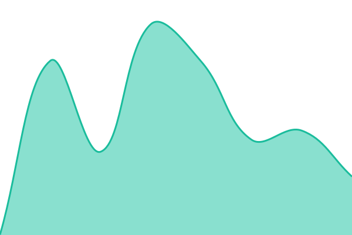
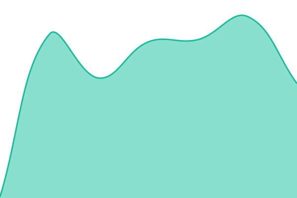

# [📈 Live Status](https://ri-scale.github.io/monitoring): <!--live status--> **🟩 All systems operational**

This repository contains the open-source uptime monitor and status page for [RI-SCALE](https://www.riscale.eu/), powered by [Upptime](https://github.com/upptime/upptime).

With [Upptime](https://upptime.js.org), you can get your own unlimited and free uptime monitor and status page, powered entirely by a GitHub repository. We use [Issues](https://github.com/ri-scale/upptime/issues) as incident reports, [Actions](https://github.com/ri-scale/upptime/actions) as uptime monitors, and [Pages](https://ri-scale.github.io/upptime) for the status page.

<!--start: status pages-->
<!-- This summary is generated by Upptime (https://github.com/upptime/upptime) -->
<!-- Do not edit this manually, your changes will be overwritten -->
<!-- prettier-ignore -->
| URL | Status | History | Response Time | Uptime |
| --- | ------ | ------- | ------------- | ------ |
|  [Rucio](ri-scale-server.rucioit.cern.ch) | 🟩 Up | [rucio.yml](https://github.com/RI-SCALE/monitoring/commits/HEAD/history/rucio.yml) | 

 124ms
     
 | 

<a href="https://ri-scale.github.io/monitoring/history/rucio">100.00%</a>
    

|  [FTS](fts-egi.cern.ch) | 🟩 Up | [fts.yml](https://github.com/RI-SCALE/monitoring/commits/HEAD/history/fts.yml) | 

 127ms
     
 | 

<a href="https://ri-scale.github.io/monitoring/history/fts">100.00%</a>
    

|  [Model Hub](modelhub.riscale.eu) | 🟩 Up | [model-hub.yml](https://github.com/RI-SCALE/monitoring/commits/HEAD/history/model-hub.yml) | 

 334ms
     
 | 

<a href="https://ri-scale.github.io/monitoring/history/model-hub">100.00%</a>
    

|  [EGI Check-in Dev](aai-dev.egi.eu) | 🟩 Up | [egi-check-in-dev.yml](https://github.com/RI-SCALE/monitoring/commits/HEAD/history/egi-check-in-dev.yml) | 

 2730ms
     
 | 

<a href="https://ri-scale.github.io/monitoring/history/egi-check-in-dev">100.00%</a>
    

|  [XrootD MUSICA LINZ](stg-xrootdm-01.musica.lnz.asc.ac.at) | 🟩 Up | [xroot-d-musica-linz.yml](https://github.com/RI-SCALE/monitoring/commits/HEAD/history/xroot-d-musica-linz.yml) | 

 134ms
     
 | 

<a href="https://ri-scale.github.io/monitoring/history/xroot-d-musica-linz">100.00%</a>
    

|  [TUBITAK TEAPOT](riscale-ui.ulakbim.gov.tr) | 🟩 Up | [tubitak-teapot.yml](https://github.com/RI-SCALE/monitoring/commits/HEAD/history/tubitak-teapot.yml) | 

 167ms
     
 | 

<a href="https://ri-scale.github.io/monitoring/history/tubitak-teapot">100.00%</a>
    

<!--end: status pages-->

[**Visit our status website →**](https://ri-scale.github.io/monitoring)

## 📄 License

- Powered by: [Upptime](https://github.com/upptime/upptime)
- Code: [MIT](./LICENSE) © [Anand Chowdhary](https://anandchowdhary.com)
- Data in the `./history` directory: [Open Database License](https://opendatacommons.org/licenses/odbl/1-0/)
